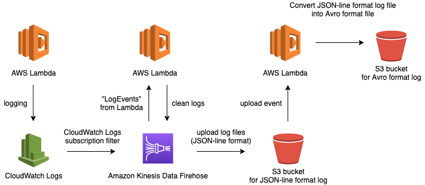

# test-enjou-log-etl

AWS CloudFormation を用いて，ログを処理する ETL タスクのためのリソースのプロビジョニングを行う．

## インフラ構成

### ETL タスクの流れ

```txt
AWS Lambda --> CloudWatch Logs --(サブスクリプションフィルタ)--> Firehose -> S3
```

### システムアーキテクチャ



### AWS リソース

resouce prefix: `test-enjou-log-etl-cfn`

## デプロイ

### 準備

TODO: 一時的なバケットを作成して終わったらそれを消去するとかできたらいいね．

- Lambda の Deploy Package の zip 用の S3 バケットを作成しておく
  - 引数 `deploy` を渡さない場合，変更セットの作成で止まる

```sh
sh create-bucket-for-lambda-deploy-packages.sh deploy
```

### スタックの作成

スタックの作成を行う．

```sh
# 引数 `deploy` を渡さない場合，変更セットの作成で止まる
sh deploy.sh deploy

# スタックの作成に失敗したら
sh utils/log.sh [STACK NAME]  # エラーログの出力
sh utils/delete-stack [STACK NAME]  # スタックの消去
```

スクリプト内で行っているのは以下の 2 つの処理：

- Lambda のデプロイパッケージのアップロード
  - 「準備」のセクションで作成した S3 バケットへ Lambda の deploy package をアップロードし，そのリソース ID を含んだテンプレートファイルを生成する
- ETL タスクのスタックの作成

## メモ

- CloudFormation 上の Stack の消去

```sh
sh utils/delete-stack [STACK NAME]
```

- スタックのエラーログの見方
  - JSON 形式のログファイルから `CREATE_FAILED` を探すと原因が分かる

```sh
sh utils/log.sh [STACK NAME]
```
