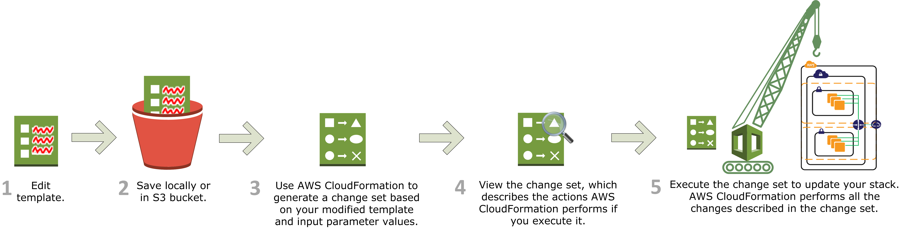

# AWS CloudFormation

## 参考

- Classmethod
  - [【CloudFormation 入門】5 分と 6 行で始める AWS CloudFormation テンプレートによるインフラ構築](https://dev.classmethod.jp/articles/cloudformation-beginner01/)

## AWS CloudFormation とは

- 公式 doc：[AWS CloudFormation とは](https://docs.aws.amazon.com/ja_jp/AWSCloudFormation/latest/UserGuide/Welcome.html)

AWS CloudFormation は Amazon Web Services リソースのモデル化およびセットアップに役立つサービスであ．リソース管理に割く時間を減らし，AWS で実行するアプリケーションにさらに注力できるようになる．

使用する全ての AWS リソース（Amazon EC2 インスタンスや Amazon RDS DB インスタンスなど）を記述する**テンプレート**というテキストファイルを作成すれば，AWS CloudFormation がユーザに代わってこれらのリソースのプロビジョニングや設定を受け持ってくれる．AWS リソースを個別に作成，設計して，それぞれの依存関係を考える必要はなくなる．AWS CloudFormation が全てを処理する．以下のシナリオは，AWS CloudFormation がどのように役立つかを示す．

- CloudFormation でできること
  - **AWS リソースの構成を全てテキストファイルとして記述し，リソースのプロビジョニングを自動化するサービス**
    - 「プロビジョニング」＝「AWS のサービス（S3，RDS，ELB など）を利用・運用可能な状態にすること」を表す
  - AWS リソースの個別のプロビジョニングが必要なくなり，インフラの設定が楽になる．再現性がある．
  - インフラの設定全て記述されているため，可用性などのためにインフラを増強する際にも設定を使いまわしてすぐに複製できる
  - テキストファイルという性質上，インフラの制御（アップグレード / ロールバック）や変更の追跡（Git などで管理）が容易になる

### インフラストラクチャ管理を簡略化

バックエンドデータベースを含むスケーラブルなウェブアプリケーションでは，

- Auto Scaling グループ
- Elastic Load Balancing ロードバランサー
- Amazon Relational Database Service データベースインスタンス

等を使用している場合がある．通常，それぞれ個別のサービスを使用して，これらのリソースをプロビジョニングしているかもしれない．また，リソースを作成した後，これらのサービスが一緒に動作する（AWS サービス間の相互作用）ように設定する必要があるだろう．このような作業は，まだアプリケーションを運用していない内から，複雑な手間と時間がかかる．

ユーザはこれらのインフラに関する個別の設定を行う代わりに，AWS CloudFormation の既存のテンプレートを作成または変更できる．テンプレートは，システムを構成する全てのリソースおよびプロパティについて記述する．テンプレートを使用して **AWS CloudFormation スタック**を作成すると，AWS CloudFormation が Auto Scaling グループ，ロードバランサー，およびデータベースを自動でプロビジョニングする．スタックが正常に作成されると，AWS リソースの利用を開始できる．スタックの削除も同様に簡単である．スタックの全てのリソースを削除できる．

AWS CloudFormation を使用すると，リソースのコレクションを単一のユニットとして簡単に管理できるようになる．

### インフラストラクチャをすばやく複製

アプリケーションに追加の可用性が必要な場合は，複数のリージョンに複製し，1 つのリージョンが使用できなくなった場合でも他のリージョンでアプリケーションを使用できるようにする．アプリケーションの複製における課題は，リソースも複製する必要があることである．アプリケーションに必要な全てのリソースを記録する必要があるだけでなく，それぞれのリージョンでそれらのリソースをプロビジョニングし，設定する必要がある．

AWS CloudFormation を使用すると，テンプレートを再利用してリソースをいつでも繰り返しセットアップできる．一度だけリソースを記述すれば，複数のリージョンで同じリソースを何度でもプロビジョニングできる．

### インフラストラクチャの制御や変更の追跡も簡単

場合によっては，基盤となるリソースを段階的にアップグレードすることがある．例えば，Auto Scaling グループのインスタンスの最大数を減らすために，Auto Scaling 起動インスタンスをより効率のいいインスタンスタイプに変更する場合がある．更新が完了した後で問題が発生した場合，インフラストラクチャを最初の設定にロールバックする必要がある場合がある．これを手動で行うには，変更したリソースを覚えておく必要があるだけではなく，最初の設定を知っておく必要がある．

AWS CloudFormation でインフラストラクチャをプロビジョニングすると，AWS CloudFormation テンプレートにプロビジョニングされたリソースやその設定が正確に記述される．これらのテンプレートはテキストファイルであるため，テンプレート間の違いを追跡するだけでインフラストラクチャに対する変更を追跡できる．これは開発者がソースコードの変更を管理する方法に似ている．例えば，バージョン管理システムをテンプレートに使用して，変更内容，変更者，変更日時を正確に把握できる．インフラストラクチャの変更を元に戻す必要がある場合はいつでも，テンプレートの以前のバージョンを使用できる．

### 補足：「プロビジョニング」とは

- プロビジョニング provisioning
  - 設備やサービスに新たな利用申請や需要が生じた際に，資源の割り当てや設定などを行い，利用や運用が可能な状態にすること
  - ここでは「AWS のサービス（S3，RDS，ELB など）を利用・運用可能な状態にすること」を表す
  - 対象や分野によってサーバプロビジョニング，ユーザープロビジョニング，サービスプロビジョニングなどがある

---

## AWS CloudFormation の概念

- 公式 doc：[AWS CloudFormation の概念](https://docs.aws.amazon.com/ja_jp/AWSCloudFormation/latest/UserGuide/cfn-whatis-concepts.html)

AWS CloudFormation を使用する際には，テンプレートとスタックの作業を行う，
テンプレートは，AWS リソースとそのプロパティを記述するために作成する．
スタックを作成するたびに，AWS CloudFormation はテンプレートに記述されているリソースをプロビジョニング（リソースを利用・運用可能な状態にする）する．

- テンプレート
- スタック
- 変更セット

### AWS CloudFormation の概観

全体的としては，JSON / YAML 形式のテンプレートテキストから，CloudFormation を経由してスタックを作成し，そのスタックの単位でリソースの集合を管理するという流れとなる．

スタックでリソースを管理しておくことで，CloudFormation にテンプレートを流したあと，「やっぱりちょっと設定変えてやり直したい」といったときに，スタックを削除すれば，簡単に作ったリソースを削除できる．最初のトライアンドエラー時期には，非常に便利である（CLI 経由でやるとワンコマンドでスタックの作成 / 消去ができるから楽）．

### テンプレート

- **テンプレート** template
  - **AWS リソースの構成を定義する JSON/YAML 形式のテキストファイル．CloudFormation はこのファイルに従ってリソースのプロビジョニングを行う．**
  - **必要なリソースとそのリソースの設定を記述する**
- **AWS CloudFormation**
  - テンプレートに従って AWS リソースを管理するためのフレームワーク．CloudFormation は，AWS リソースをスタックという概念で管理する．
  - 役割
    - スタックの作成
    - スタックの更新
    - エラー検知とロールバック

AWS CloudFormation テンプレートは JSON または YAML 形式のテキストファイルである，

これらのファイルは，

- `.json`
- `.yml`
- `.template`
- `.txt`

などの拡張子を使用して保存できる，
AWS CloudFormation はこれらのテンプレートを AWS リソースを作成する際の設計図として使用する，
例えば，テンプレートには，Amazon EC2 インスタンスの情報を記述できる．

- Amazon EC2 インスタンスの情報
  - インスタンスタイプ
  - AMI ID
  - ブロックデバイスマッピング
  - Amazon EC2 キーペアの名前
  - etc...

スタックを作成する際には必ず，AWS CloudFormation がテンプレートの記述内容を作成するために使用するテンプレートも指定する，

例えば，以下のテンプレートを指定してスタックを作成した場合，AWS CloudFormation では，`ami-0ff8a91507f77f867` AMI ID，`t2.micro` インスタンスタイプ，`testkey` キーペアの名前，および Amazon EBS ボリュームを持つインスタンスをプロビジョニングする，

- ex) `template.json`

```json
{
  "AWSTemplateFormatVersion": "2010-09-09",
  "Description": "A sample template",
  "Resources": {
    "MyEC2Instance": {
      "Type": "AWS::EC2::Instance",
      "Properties": {
        "ImageId": "ami-0ff8a91507f77f867",
        "InstanceType": "t2.micro",
        "KeyName": "testkey",
        "BlockDeviceMappings": [
          {
            "DeviceName": "/dev/sdm",
            "Ebs": {
              "VolumeType": "io1",
              "Iops": "200",
              "DeleteOnTermination": "false",
              "VolumeSize": "20"
            }
          }
        ]
      }
    }
  }
}
```

- ex) `template.yml`

```yml
AWSTemplateFormatVersion: "2010-09-09"
Description: A sample template
Resources:
  MyEC2Instance:
    Type: "AWS::EC2::Instance"
    Properties:
      ImageId: "ami-0ff8a91507f77f867"
      InstanceType: t2.micro
      KeyName: testkey
      BlockDeviceMappings:
        - DeviceName: /dev/sdm
          Ebs:
            VolumeType: io1
            Iops: 200
            DeleteOnTermination: false
            VolumeSize: 20
```

また，単独のテンプレートに複数のリソースを指定し，これらのリソースが連携するように設定することができる．
例えば，Elastic IP（EIP）を含み，Amazon EC2 インスタンスとの関連付けを持つように，上記のテンプレートを変更することができる，

- ex) `template.json`

```json
{
  "AWSTemplateFormatVersion": "2010-09-09",
  "Description": "A sample template",
  "Resources": {
    "MyEC2Instance": {
      "Type": "AWS::EC2::Instance",
      "Properties": {
        "ImageId": "ami-0ff8a91507f77f867",
        "InstanceType": "t2.micro",
        "KeyName": "testkey",
        "BlockDeviceMappings": [
          {
            "DeviceName": "/dev/sdm",
            "Ebs": {
              "VolumeType": "io1",
              "Iops": "200",
              "DeleteOnTermination": "false",
              "VolumeSize": "20"
            }
          }
        ]
      }
    },
    "MyEIP": {
      "Type": "AWS::EC2::EIP",
      "Properties": {
        "InstanceId": { "Ref": "MyEC2Instance" }
      }
    }
  }
}
```

- ex) `template.yml`

```yml
AWSTemplateFormatVersion: "2010-09-09"
Description: A sample template
Resources:
  MyEC2Instance:
    Type: "AWS::EC2::Instance"
    Properties:
      ImageId: "ami-0ff8a91507f77f867"
      InstanceType: t2.micro
      KeyName: testkey
      BlockDeviceMappings:
        - DeviceName: /dev/sdm
          Ebs:
            VolumeType: io1
            Iops: 200
            DeleteOnTermination: false
            VolumeSize: 20
  MyEIP:
    Type: AWS::EC2::EIP
    Properties:
      InstanceId: !Ref MyEC2Instance
```

上記のテンプレートは，単一の Amazon EC2 インスタンスについて記述したものだが，AWS CloudFormation テンプレートの追加機能により，複雑なリソースセットを構築して，それらのテンプレートを複数のコンテキストで再利用することができる，
例えば，AWS CloudFormation スタックの作成時に値を設定できる入力パラメータを追加できる．
つまり，インスタンスタイプなどの値を，テンプレート作成時ではなく，スタック作成時に指定することができ，
さまざまな状況でテンプレートを再利用しやすくなる（**この「パラメータ」って環境変数みたいなものかな？**），

- テンプレートの作成や機能に関する詳細については，「[テンプレートの分析](https://docs.aws.amazon.com/ja_jp/AWSCloudFormation/latest/UserGuide/template-anatomy.html)」を参照．
- 特定のリソースを宣言する詳細については，[AWS リソースおよびプロパティタイプのリファレンス](https://docs.aws.amazon.com/ja_jp/AWSCloudFormation/latest/UserGuide/aws-template-resource-type-ref.html) を参照してください，

AWS CloudFormation デザイナーで独自のテンプレートを設計するには，「https://console.aws.amazon.com/cloudformation/designer」を参照．

### スタック

- **スタック** stack
  - **テンプレートのリソース定義に従ってプロビジョニングされる AWS リソースの集合のこと**
  - スタック単位でリソースの管理が可能．スタックの破棄を実行すると，スタックに紐づく全てのリソースを破棄することが可能
  - 使用するリソース及びリソースの構築順は，テンプレートの依存関係から CloudFormation が自動的に決定

AWS CloudFormation を使用する際，関連リソースはスタックと呼ばれる単一のユニットとして管理する（**1 テンプレート 1 スタック**）．
スタックを作成，更新，削除することで，リソースのコレクション（AWS リソースの組み合わせ，例えば「S3 + Lambda」など）を作成，更新，削除する．
スタック内の全てのリソースは，スタックの AWS CloudFormation テンプレートで定義される，

例えば，以下のリソースを含むテンプレートを作成したとする．

- リソースのコレクション
  - Auto Scaling グループ
  - Elastic Load Balancing ロードバランサー
  - Amazon Relational Database Service（Amazon RDS）データベースインスタンス

これらのリソースを作成するには，AWS CLI やコンソールから，作成したテンプレートを送信することによってスタックを作成する．すると，AWS CloudFormation によって全てのリソースがプロビジョニングされる，
スタックの操作には，以下 3 つのインターフェースから使用できる，

- AWS CloudFormation コンソール
- API
- AWS CLI

スタックの作成，更新，または削除の詳細については，[スタックの操作](https://docs.aws.amazon.com/ja_jp/AWSCloudFormation/latest/UserGuide/stacks.html)を参照．

### 変更セット

- **変更セット**
  - スタックの変更が与える影響を確認するための仕組み
  - dry-run 的な？

スタックで実行中のリソースに変更を加える必要がある場合は，スタックを更新する．
リソースに変更を加える前に，「変更案の概要」である変更セットを生成できる．
変更セットで，変更が実行中のリソース，特に重要なリソースに与える可能性のある影響を実装前に確認できます，

例えば，Amazon RDS データベースインスタンスの名前を変更すると，AWS CloudFormation によって新しいデータベースが作成され，古いものは削除される．古いデータベースのデータは，バックアップしていない限り失われる．
変更セットを生成すると，変更によってデータベースが置き換えられることが分かり，スタックを更新する前に対応策を立てることができる．詳細については，「[変更セットを使用したスタックの更新](https://docs.aws.amazon.com/ja_jp/AWSCloudFormation/latest/UserGuide/using-cfn-updating-stacks-changesets.html)」を参照．

---

## AWS CloudFormation の仕組み

- 公式 doc：[AWS CloudFormation の仕組み](https://docs.aws.amazon.com/ja_jp/AWSCloudFormation/latest/UserGuide/cfn-whatis-howdoesitwork.html)

目次

- AWS CloudFormation の仕組み：概要
- 変更セットを使用したスタックの更新
- スタックの削除
- その他のリソース

### AWS CloudFormation の仕組み：概要

スタックを作成すると，AWS CloudFormation は AWS から基盤となるサービスを呼び出し，リソースをプロビジョニングして設定する．AWS CloudFormation が実行できるアクションはユーザがアクセス権限を持つものだけであることに注意する．

例えば，AWS CloudFormation を使用して EC2 インスタンスを作成するには，インスタンスを作成するアクセス権限が必要である（ここはひとまず `AdministratorAccess` ポリシーを付与した IAM ロールでやれば詰まることはない．ただし，本番ではやっちゃダメ．）．インスタンスのスタックを削除する場合も同様に，インスタンスを削除するアクセス権限が必要である．
AWS Identity and Access Management（IAM）を使用してアクセス権限を管理できる．

AWS CloudFormation が行う呼び出しは，全てテンプレートで宣言される．
例えば，EC2 インスタンスのインスタンスタイプを `t1.micro` と記述するテンプレートがあるとする．このテンプレートを使ってスタックを作成すると，
AWS CloudFormation は Amazon EC2 作成インスタンス API を呼び出し，インスタンスタイプを `t1.micro` と指定する．次の図は，AWS CloudFormation でスタック作成を行うワークフローの概要である．


1. AWS CloudFormation テンプレート（JSON または YAML 形式のテキストファイル）は，「[AWS CloudFormation デザイナー](https://console.aws.amazon.com/cloudformation/designer)」で設計することも，テキストエディタで記述することもできる．用意されたテンプレートを使用することもできる．**テンプレートは必要なリソースとその設定を記述する**．例えば，EC2 インスタンスを作成するとする．テンプレートは次の例のように EC2 インスタンスを宣言してそのプロパティを記述するものになる．
   - ex) `template.json`

     ```json
     {
       "AWSTemplateFormatVersion": "2010-09-09",
       "Description": "A simple EC2 instance",
       "Resources": {
         "MyEC2Instance": {
           "Type": "AWS::EC2::Instance",
           "Properties": {
             "ImageId": "ami-0ff8a91507f77f867",
             "InstanceType": "t1.micro"
           }
         }
       }
     }
     ```

   - ex) `template.yml`

     ```yml
     AWSTemplateFormatVersion: "2010-09-09"
     Description: A simple EC2 instance
     Resources:
       MyEC2Instance:
         Type: AWS::EC2::Instance
         Properties:
           ImageId: ami-0ff8a91507f77f867
           InstanceType: t1.micro
     ```

2. テンプレートをローカルまたは S3 バケットに保存する．テンプレートを作成した場合は，`.json`，`.yml`，または `.txt` などのファイル拡張子を使用して保存する．
3. テンプレートのファイルの場所（ローカルコンピュータのパスや Amazon S3 の URL など）を指定し，AWS CloudFormation スタックを作成する．テンプレートにパラメーターが含まれる場合は，スタック作成時に入力値を指定できる．パラメーターを使用してテンプレートに値を渡すことで，スタックを作成するたびにリソースをカスタマイズできる．
AWS CloudFormation コンソール，API，または AWS CLI を使用してスタックを作成できる．
   - **注記**
     - ローカルに保存されたテンプレートファイルを指定する場合，AWS CloudFormation はそれを AWS アカウントの S3 バケットにアップロードする．AWS CloudFormation は各リージョンにテンプレートファイルをアップロードするバケットを作成する．AWS アカウントの Amazon Simple Storage Service（Amazon S3）アクセス権限があれば誰でもこのバケットにアクセスできる．AWS CloudFormation が作成したバケットが既に存在する場合は，テンプレートはそのバケットに追加される（**どういう影響があるのかまだ分かってない**）．
     - 手動でテンプレートを Amazon S3 にアップロードすることで，独自のバケットを使用してアクセス権限を管理できる．その場合は，スタックを作成または更新するたびに，テンプレートファイルの Amazon S3 URL を指定する．

AWS CloudFormation はテンプレートに記述されている AWS サービスを呼び出して，リソースをプロビジョニングし設定する．

全てのリソースの作成が完了すると，AWS CloudFormation はスタックが正常に作成されたというレポートを送信する．
これで，スタック内のリソースが使用できるようになる．
スタックの作成が失敗した場合，AWS CloudFormation は作成したリソースを削除して，変更をロールバックする．

### 変更セットを使用したスタックの更新

- スタックの更新の流れ
  - テンプレートの修正 -> CloudFormation を使って変更セットを作成する -> 変更セットを良く見て，実行するか決める -> スタックの更新を行う
  - スタックの更新により，現在動いている既存リソースが中断されたり，置き換えられる場合もある．スタックの更新は注意深く実行する必要がある．

スタックのリソースを更新する必要がある場合，スタックのテンプレートを変更できる．
新しいスタックを作成して古いものを削除する必要はない．

スタックを更新するには，元のスタックテンプレートの修正バージョン，異なる入力パラメータ値，またはその両方を送信して「変更セット」を作成する．AWS CloudFormation は修正済みのテンプレートを元のテンプレートと比較し，変更セットを生成する．変更セットには，変更案がリストされる．変更を確認したら，変更セットを実行してスタックを更新する．更新しない場合は新しい変更セットを作成できる．次の図は，スタックを更新するワークフローの概要です．



- **重要**
  - 更新によって中断が発生する場合がある．更新しているリソースやプロパティによって，既存のリソースが中断されたり，置き換えられる場合もある．詳細については，「[AWS CloudFormation スタックの更新](https://docs.aws.amazon.com/ja_jp/AWSCloudFormation/latest/UserGuide/using-cfn-updating-stacks.html)」を参照．

1. AWS CloudFormation スタックテンプレートは AWS CloudFormation デザイナー またはテキストエディタで変更できる．例えば，EC2 インスタンスのインスタンスタイプを変更する場合，元のスタックのテンプレートの InstanceType プロパティの値を変更する．
   - 詳細については，「[スタックテンプレートの変更](https://docs.aws.amazon.com/ja_jp/AWSCloudFormation/latest/UserGuide/using-cfn-updating-stacks-get-template.html)」を参照
2. AWS CloudFormation テンプレートをローカルまたは S3 バケットに保存する
3. 更新するスタックおよび修正済みテンプレートの場所（ローカルコンピューターのパスや Amazon S3 の URL など）を指定し，変更セットを作成する．テンプレートにパラメーターが含まれる場合は，変更セットの作成時に値を指定できます．
   - 変更セットの作成方法については，[変更セットを使用したスタックの更新](https://docs.aws.amazon.com/ja_jp/AWSCloudFormation/latest/UserGuide/using-cfn-updating-stacks-changesets.html) を参照
   - **注記**
     - ローカルコンピューターに保存されたテンプレートを指定する場合，AWS CloudFormation は自動的に AWS アカウントの S3 バケットにテンプレートをアップロードする
4. 変更セットを参照し，AWS CloudFormation が想定どおりに変更を実行することを確認する．例えば，AWS CloudFormation が重要なスタック・リソースを置き換えるかどうかなどは注意が必要．必要な変更が含まれるまで，いくつでも変更セットを作成できる．
   - **重要**
     - 変更セットでは，スタックの更新が正常に行われるかどうかは分からない．例えば，アカウント制限を超過する，更新をサポートしていないリソースを更新しようとしている，リソースの変更に必要なアクセス権限が足りていないなど，スタックの更新が失敗する原因になる可能性があるものを変更セットでは確認できない．
5. スタックに適用する変更セットを実行する．AWS CloudFormation では，**変更したリソースのみを更新することでスタックを更新し**，スタックが正常に更新された信号を送信する．スタックの更新が失敗した場合，AWS CloudFormation は変更箇所をロールバックして，スタックを正常な稼働が確認されている最新の状態に復元する．

### スタックの削除

**スタックを削除する場合，削除するスタックを指定する**．
AWS CloudFormation はそのスタックとスタック内の全てのリソースを削除する．
AWS CloudFormation コンソール，API，または AWS CLI を使用してスタックを削除できる．

スタックを削除してもその中のいくつかのリソースを保持する場合は，削除ポリシーを使用してそのリソースを保持できる．

全てのリソースの削除が完了すると，AWS CloudFormation はスタックが正常に削除されたというシグナルを送信する．
AWS CloudFormation がリソースを削除できない場合，スタックは削除されない．
削除されなかったリソースは，スタックが正常に削除されるまで保持され続ける．

### その他のリソース

- AWS CloudFormation テンプレート作成の詳細については，「[テンプレートの分析](https://docs.aws.amazon.com/ja_jp/AWSCloudFormation/latest/UserGuide/template-anatomy.html)」を参照．
- スタックの作成，更新，または削除の詳細については，[スタックの操作](https://docs.aws.amazon.com/ja_jp/AWSCloudFormation/latest/UserGuide/stacks.html)を参照してください．

---

## CloudFormation のセットアップ

AWS CloudFormation を使用する前に，どの IAM のアクセス権限が必要か，AWS CloudFormation API 呼び出しのログ記録の開始方法，または使用するエンドポイントについて知っておく必要がある．以下のトピックでは，AWS CloudFormation の使用を開始できるように，この情報を提供する．

- トピック
  - AWS アカウントへのサインアップと料金
  - AWS CloudFormation のクォータ
  - AWS CloudFormation エンドポイント
  - AWS CloudFormation の VPC エンドポイントの設定
