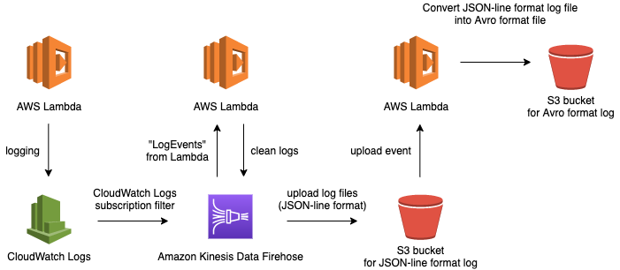

# test-etl

AWS Lambda --> CloudWatch Logs --(サブスクリプションフィルタ)--> Firehose -> S3

## システムアーキテクチャ

## AWS リソース

パイプラインで使用しているリソース一覧

TODO: いろいろ整ってからで良い

- **AWS Lambda**
  - `test-cloudwatch-logs-to-s3`
    - デバッグでログを流す用に作成した関数
      - Lambda のコンソールのテストからすぐにログを流せる
    - サブスクリプションフィルタに登録するロググループを作る
    - 実際には，この Lambda 関数はログを吐ける任意の AWS リソースに置き換えることができる．今回は，ただ単にデバッグするための準備が楽だから Lambda を利用している
      - Lambda ロググループを自動で作成してくれる（Lambda を使えば CloudWatch Logs 周りの設定をしなくて良い）
      - コンソールから「テスト」を実行すればログを吐くことができ，サブスクリプションフィルタ経由で ETL タスクが動いてくれる
  - `test-cloud-watch-logs-to-s3-firehose-transformation`
    - Firehose 上でログを整形するための関数
      - メタデータの除去
      - JSON 形式として吐かれたログのみを取得するためのフィルタリング
    - JSON-line 形式のログを吐く
  - `test-s3-to-s3-avro-transformation`
    - S3 に JSON-line 形式のログが吐かれたのをトリガーに，それを Avro 形式に変換するための関数
- **CloudWatch Logs**
  - `/aws/lambda/test-cloudwatch-logs-to-s3`
    - Lambda 関数 `test-cloudwatch-logs-to-s3` の作成により自動で作られるロググループ．この関数のログが吐かれる．
    - このロググループに対してサブスクリプションフィルタを登録すると，このロググループにログが吐かれる度に Firehose にログデータを流す
    - **このリソースに関係のある他の AWS リソース**
      - Firehose：`test-cloudwatch-logs-to-s3`
        - この配信ストリームにログを流す
- **Amazon Kinesis Data Firehose**
  - `test-cloudwatch-logs-to-s3`
    - 配信ストリーム．CloudWatch Logs からのログを S3 に "高速に" 横流しにする．
    - **このリソースに関係のある他の AWS リソース**
      - Lambda：`test-cloud-watch-logs-to-s3-firehose-transformation`
        - ログを流す際，この Lambda 関数を実行し，ログを整形する．整形後のログ（JSON-line 形式）が S3 バケット `test-cloudwatch-logs-to-s3` に吐かれる．
      - S3：`test-cloudwatch-logs-to-s3`
        - 配信ストリームのターゲットとなる S3 バケット．整形後のログ（JSON-line 形式）がこのバケットに吐かれる．
- **Amazon S3**
  - バケット 2 つ
    - `test-cloudwatch-logs-to-s3`
      - JSON-line 形式のログファイル用のバケット
      - ファイルアップロードにより，Lambda 関数 `test-s3-to-s3-avro-transformation` がトリガーされる
    - `test-cloudwatch-logs-to-s3-avro`
      - Avro 形式に変換後のログファイル用のバケット
      - Lambda 関数 `test-s3-to-s3-avro-transformation` により，このバケットに Avro 形式のファイルが吐かれる
- **IAM**
  - TODO: 各サービスがどのサービスへのアクセス権限があるかというのを定義するための色んなロール，ポリシーが必要になる

## ETL タスクのデバッグ

ETL タスクのデバッグを行いたい時は，Lambda 関数 `test-cloudwatch-logs-to-s3` のコンソールから「テスト」を実行すれば，ログを処理する ETL のプロセスが走るようになっている．

ETL のアウトプット先は以下の S3 バケット：

- S3 バケット
  - `test-cloudwatch-logs-to-s3`
    - JSON-line 形式のログファイル用のバケット
  - `test-cloudwatch-logs-to-s3-avro`
    - JSON-line 形式のログファイルを Avro 形式に変換したファイル用のバケット
